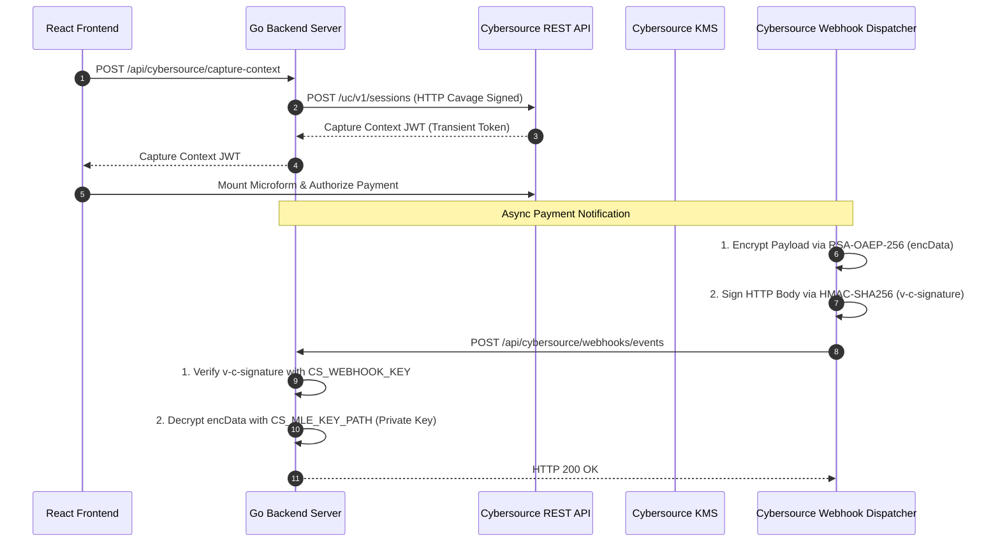

# Cybersource Unified Checkout & Webhook Integration

A complete, production-ready Go backend and React frontend implementing **Cybersource Unified Checkout (UC)** with **Message-Level Encryption (MLE)** and **Webhook Digital Signature Verification**.

---

## 📑 Table of Contents

- [Architecture & Security Overview](#-architecture--security-overview)
- [Key Systems Explained](#-key-systems-explained)
- [Environment Configuration (`.env`)](#-environment-configuration-env)
- [Step-by-Step Webhook & MLE Setup (Steps 1–8)](#-step-by-step-webhook--mle-setup)
- [CLI Tool Reference (`cmd/webhook`)](#-cli-tool-reference)
- [Running the Project](#-running-the-project)
- [Troubleshooting & FAQs](#-troubleshooting--faqs)

---

## 🏛 Architecture & Security Overview



---

## 🔑 Key Systems Explained

The backend utilizes three distinct cryptographic key systems:

| Key System | Variables in `.env` | Key Type | Purpose | Direction |
| :--- | :--- | :--- | :--- | :--- |
| **1. REST API Credentials** | `CS_KEY_ID`<br>`CS_SECRET_KEY` | Symmetric HMAC | **Authenticates outgoing requests** (e.g. creating Capture Context sessions). | Server $\rightarrow$ Cybersource |
| **2. Webhook Signature Key** | `CS_WEBHOOK_KEY_ID`<br>`CS_WEBHOOK_KEY` | Symmetric HMAC | **Verifies incoming webhook authenticity** (`v-c-signature` header). | Cybersource $\rightarrow$ Server |
| **3. Message-Level Encryption (MLE)** | `CS_MLE_KEY_ID`<br>`CS_MLE_KEY_PATH` | Asymmetric RSA-2048 | **Protects payload confidentiality** (Cybersource encrypts with Public Key, server decrypts with Private Key). | Cybersource $\rightarrow$ Server |

---

## ⚙ Environment Configuration (`.env`)

Create or update `backend/.env` with your credentials:

```ini
# Cybersource Merchant Profile & REST API Credentials
CS_MERCHANT_ID=inverse_amazon_trans
CS_KEY_ID=98ec4c32-69c3-4a79-a7d6-bdf5b96900d6
CS_SECRET_KEY=XiqTLaEmKQwIamsApfMtmt2Z6DQ6+clSS82D/TewVYs=

# Webhook Digital Signature Key (From Cybersource KMS - Step 3)
CS_WEBHOOK_KEY_ID=2e5b60a7-0c59-4050-985a-affaece96e04
CS_WEBHOOK_KEY=m4z1N5t/1jYmHQi0/7jlGmbw7Vw0TNSXjeG9p58RB9A=

# Message-Level Encryption (MLE) Key (From Cybersource KMS - Step 2)
CS_MLE_KEY_ID=29e1badd-5943-4075-aa1f-a64677f6ad23
CS_MLE_KEY_PATH=certs/inverse_amazon_trans_private.pem
```

---

## 🚀 Step-by-Step Webhook & MLE Setup

All management tasks can be performed using the CLI tool in `backend/cmd/webhook`:

```bash
cd backend
```

### **STEP 1: Generate Certificate & RSA-2048 Key Pair**

#### **Option A — Automated (Recommended):**
Generates an RSA-2048 private key and X.509 certificate bound to `CN=CS_KEY_ID` and `O=CS_MERCHANT_ID`, saves to `certs/`, and registers with KMS in one command:
```bash
go run cmd/webhook/main.go generate-mle-key
```

#### **Option B — Manual via OpenSSL:**
```bash
openssl req -x509 -newkey rsa:2048 \
  -keyout certs/inverse_amazon_trans_private.pem \
  -out certs/inverse_amazon_trans_certificate.pem \
  -days 90 -nodes \
  -subj "/CN=98ec4c32-69c3-4a79-a7d6-bdf5b96900d6/O=inverse_amazon_trans/C=US"
```

---

### **STEP 2: Register Certificate with Cybersource KMS**

If created via OpenSSL (Option B), register the certificate using the CLI:
```bash
go run cmd/webhook/main.go generate-mle-key \
  -cert certs/inverse_amazon_trans_certificate.pem \
  -key certs/inverse_amazon_trans_private.pem
```

To view the active registered certificate and its validity:
```bash
go run cmd/webhook/main.go get-mle-cert
```

---

### **STEP 3: Generate Webhook Digital Signature Key**

Creates the HMAC-SHA256 symmetric secret for `v-c-signature` verification and automatically updates `CS_WEBHOOK_KEY_ID` and `CS_WEBHOOK_KEY` in `.env`:
```bash
go run cmd/webhook/main.go generate-key
```

---

### **STEP 4: Discover Available Products & Events**

List all webhook notification products available for your merchant:
```bash
go run cmd/webhook/main.go products
```

---

### **STEP 5: Create a Webhook Subscription**

Create an active subscription for Unified Checkout transaction results (`uc.orders.transactionresults`):
```bash
go run cmd/webhook/main.go create -url "https://your-domain.com/api/cybersource/webhooks/events"
```

---

### **STEP 6: Manage & Inspect Webhooks**

- **List all subscriptions:**
  ```bash
  go run cmd/webhook/main.go list
  ```
- **Get subscription details:**
  ```bash
  go run cmd/webhook/main.go get -id <webhookId>
  ```
- **Update webhook delivery URL:**
  ```bash
  go run cmd/webhook/main.go update -id <webhookId> -url "https://new-url.ngrok-free.app/api/cybersource/webhooks/events"
  ```
- **Reactivate a suspended subscription:**
  ```bash
  go run cmd/webhook/main.go activate -id <webhookId>
  ```
- **Delete a subscription:**
  ```bash
  go run cmd/webhook/main.go delete -id <webhookId>
  ```

---

### **STEP 7: Receive Webhook Notification**

When a transaction completes, Cybersource POSTs an encrypted JWE payload to your webhook endpoint:
```http
POST /api/cybersource/webhooks/events HTTP/1.1
Host: your-domain.com
Content-Type: application/json
v-c-event-type: uc.orders.transactionresults
v-c-signature: t=1790247878952;keyId=2e5b60a7-0c59-4050-985a-affaece96e04;sig=qz2588+...

{"encData":"eyJlbmMiOiJBMjU2R0NNIiwiaWF0IjoxNzkwMjQ3ODc4OTUyLCJhbGciOiJSU0EtT0FFUC0yNTYiLCJraWQiOiIyOWUxYmFkZC01OTQzLTQwNzUtYWExZi1hNjQ2NzdmNmFkMjMifQ..."}
```

---

### **STEP 8: Automatic Decryption & Processing**

The Go server automatically:
1. Verifies the `v-c-signature` header against `CS_WEBHOOK_KEY`.
2. Decrypts `encData` using `CS_MLE_KEY_PATH` (`certs/inverse_amazon_trans_private.pem`).
3. Logs the raw and decrypted JSON and updates the in-memory order status store.

---

## 🛠 CLI Tool Reference

```
Usage: go run cmd/webhook/main.go <command> [options]

Commands:
  products                                    List available products & event types
  create    -url <url> [-health-url <url>] [-name <name>]
                                              Create a new webhook subscription
  list                                        List all webhook subscriptions
  get       -id <webhookId>                   Get subscription details
  update    -id <webhookId> [-url <url>] [-status <ACTIVE|INACTIVE>]
                                              Update subscription URL or status
  activate  -id <webhookId>                   Reactivate a suspended webhook
  delete    -id <webhookId>                   Delete a subscription
  generate-key                                Generate a new digital signature key via KMS
  generate-mle-key [-cert <file>] [-key <file>]
                                              Generate & register MLE certificate with KMS
  get-mle-cert [-id <keyId>]                  Inspect MLE certificate details
```

---

## 💻 Running the Project

### **1. Start the Backend Server**
```bash
cd backend
go run .
```
Backend runs on `http://localhost:8080`.

### **2. Start the Frontend Application**
```bash
cd frontend
npm install
npm run dev
```
Frontend runs on `https://localhost:5173`.

### **3. Expose Localhost for Webhook Testing**
Using [ngrok](https://ngrok.com/) or VS Code / GitHub Dev Tunnels:
```bash
ngrok http 8080
```
Then update your webhook subscription with the public URL:
```bash
go run cmd/webhook/main.go update -id <webhookId> -url "https://<your-subdomain>.ngrok-free.app/api/cybersource/webhooks/events"
```

---

## ❓ Troubleshooting & FAQs

### **1. `error in cryptographic primitive` during webhook decryption**
* **Cause:** The webhook was encrypted by Cybersource using a key ID (`kid`) that does not match your server's active private key.
* **Fix:** Re-run `go run cmd/webhook/main.go generate-mle-key` to generate and register a fresh key pair with Cybersource KMS, and restart the backend.

### **2. `Reason Code 150 / HTTP 502` during Capture Context**
* **Cause:** The Cybersource merchant account does not have a payment processor assigned in test mode.
* **Fix:** Log in to [Cybersource Business Center Test Console](https://ebc2test.cybersource.com), navigate to **Payment Configuration $\rightarrow$ Processor Connections**, and verify your test processor is active.

